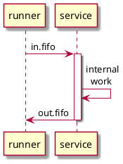

# Git Submodules
> Git


## Points


10 points


## Brief description


You are to add submodules, provide an initialising script and implement a simple script.


## Requirements


1. Add the template repository as a submodule. It must be stored as `server` directory.
2. Add `install.sh` script that contains all commands one need to run to set up a local repository when cloning
3. Add `runner.sh` script


```
runner.sh  [COLOUR]..
```


The `runner.sh` takes a sequence of colours, starts the service (it is located inside `server` submodule). Then it sends all arguments one by one as requests to service and sums up the responses. Do not forget to shut down the service after everything is done.


* To launch the service execute `service-init.sh`
* To shut down the service execute `service-shutdown.sh`


You can interact with the service via named pipes: `in.fifo` & `out.fifo`. They will be created in `server` directory after you run `service-init.sh`.


* To send a request write to `in.fifo`
* To receive a request read from `out.fifo`





## Test


1. (2) Simple
  * No more than 1 argument
2. (8) Complex
  * Almost 100 arguments


## Advices & Hints


> You do not have to follow all of them. You are free to implement your own solution.


* [Documentation](https://git-scm.com/book/en/v2/Git-Tools-Submodules)
* Beware! Template repository contains recursive submodules


